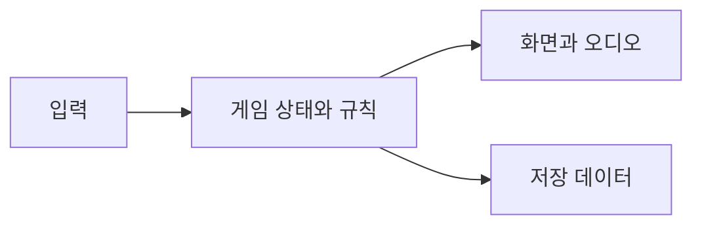

# 아키텍처

`index.html`과 `game.js`가 모드·루프·카메라를 연결합니다. `physics.js`, `player.js`, `ai.js`, `items.js`, `track.js`, `ui.js`, `story.js`가 기능을 나눕니다. `racing-world.html`은 같은 허브에서 여는 오픈월드 모드입니다.

```mermaid
flowchart LR
  I[입력] --> G[게임 상태와 규칙]
  G --> R[화면과 오디오]
  G --> S[저장 데이터]
```
